Discover Polska 

For this Capstone project, 

## Table of Contents
- [Introduction/ Purpose](#Introduction/Purpose)
- [User experience (UX)](#user-experience-ux)
   * [Objectives](#objectives)
   * [Target audience](#target-audience)
   * [User stories](#user-stories)
- [Agile Practice/ Development](#AgilePractice/Development)
- [Design](#Design)
* [Color Palette](#ColorPalette)
* [Icons & Images](#Icons&Images)
- [Features](#Features)
  * [Logo and navigation bar](#logo-and-navigation-bar)
   * [Hero image](#hero-image)
   * [Django alert messages](#django-alert-messages)
   * [Clear indication as to whether the user is logged in or out at all times](#clear-indication-as-to-whether-the-user-is-logged-in-or-out-at-all-times)
   * [Quote](#quote)
   * [A list of blog posts](#a-list-of-blog-posts)
   * [See an individual blog post in detail](#see-an-individual-blog-post-in-detail)
   * [Pagination](#pagination)
   * [About page](#about-page)
   * [Contact form](#contact-form)
   * [Sign in form](#sign-in-form)
   * [Register form (Sign up)](#register-form-sign-up)
   * [Sign out page](#sign-out-page)
- [Deployment](#Deployment)
- [Validation](#Validation)
- [Issues & Bugs](#Issues&Bugs)
- [Validation](#Validation)
- [Future Improvements](#FutureImprovements)
- [Acknowledgements](#Acknowledgements)

## Introduction/ Project Proposal 

For this capstone project, the aim was to develop a full stack website built using the Django web framework. Discover Polska is a travel blog suitable for female or solo travellers wanting to explore locations in Poland, and read comments from other travelers to get their opinion or other useful advice regarding specific locations, cities or attractions.  This website provides users with; a blog with the top attractions in Poland, comments section, and about page for users to gin insight into who the writer is (I used myself in this case as I felt it was more authentic) and a contact us form, which encouraged users, other travellers or travel companies to get in contact in order to set up collaboration, share some more hidden locations to see and other requestes. 

With its current features and any future developments, the hope is that this travel blog will become a valuable travel tool for thise wanting to explore Poland or solo travel while showcasing modern web development techniques.

The website was built using Django, HTML, CSS, and JavaScript, computer/laptop-based first, rather than mobile, however using Bootstrap ensured wide accessibility & responsiveness across various devices and platforms.

## User Expereince (UX)

### Objectives
* Create an engaging travel aid for travel enthusiasts who want to explore Poland
* Provide a user-friendly interface for finding information on travel locations
* Ensure responsiveness across different screen sizes

#### Target Audience
* Female or Solo travellers looking to explore more of Europe
* Users who are specifically wanting to explore more of Poland, including city breaks, historical monuments or nature. 
* Travel agencies/ companies who wish to get in contact to collaborate, offer funding for travel or users who want to suggest other locations not listed in the blog. 

## Technologies and AI

This project was created using the following technologies:

* Python
* Django
* Javascript for functionality and interactivity
* HTML5 for structure
* CSS3 for styling and responsiveness (Flexbox)

This ensured the project was in line with the project requirements as set out by Code Institute but also ensured that the travel blog was responsive, functional and accessible to our target audience. 

### AI

To further supplement our website design, we included the following AI technology and websites to aid in the creation of our user stories, initial design ideas and to debug any issues within our code (more on this in the 'Agile Practice' section). 

* #### [Perplexity.ai](#https://www.perplexity.ai) 
* #### [Chat GPT](#https://chatgpt.com/)
* #### Co-pilot (Github)

### Websites

* [Favicon](#https://favicon.io/)
* [Font Awesome](#https://fontawesome.com/)
* [FreePik](#https://www.freepik.com/premium-vector/karate-logo-with-red-sunset_24779702.htm)

## Agile Practice

### User Stories

GitHub Copilot provided useful suggestions for user stories, though some required adjustment to meet project goals.

The user stories for this project were generated by Perplexity.ai using the prompt:
"I'm creating a multiple choice quiz on Japanese vocab in Karate using html, css and javascript. Could you create user stories for this quiz". 

This prompt generated the necessary user storei applicable to ur project design, and it was further clarified to include the must-have, shold-have and could-have labels. 

* As a user, I want to modify or delete a comment I made on a blog post
* As a user, I want to be able to register an account on the blog using an email or username. 
* As a user I can leave comments on a post so that I can be involved in the conversation
* As a user / Admin I can view comments on an individual post so that I can read the conversation
* As a user, I can view a paginated list of posts so that I can select which post I want to view.
* As a user, I want to be able to access the blog on any device (laptop or mobile).

### Web design 

For the design of the project, 

### Wireframes

#### Prospective Wireframes 

Prior to starting the project, we designed prospective wireframes using [Balsamiq](#https://balsamiq.com/wireframes/) to have an idea of the blog's design, layout and feature placement. 

[screenshot!]. 

On a desktop/laptop, the design was similar. 

#### Final Wireframes 

Throughout the project, the wireframe deviated form the inital wireframe design. 

## Features
### Logo and navigation bar

A responsive navigatoin bar is in place for this blog. While the website was desgined for a computer/laptop view first, it is responsive across mobile devices through a burger icon, which has a dropdown menu including 'Blog', 'About', and the 'logout/login/register' options respectively. This burger icon appears on tablet view too. 

Additionally the logo, when clicked, redirects the user back to the home page (esentially the blog). See screenshots below. 

#### Monitor navigation bar

### Hero image

For my hero image, I used a Bootstrap automatic carousel with 4 aesthetic images of natural locations in Poland. This was chosen in order to add more animation and 'liveliness' to the website, keeping the user engaged and interested. Slides 1 and 4 also have messages on the images to draw the eye and resonate with the users. 

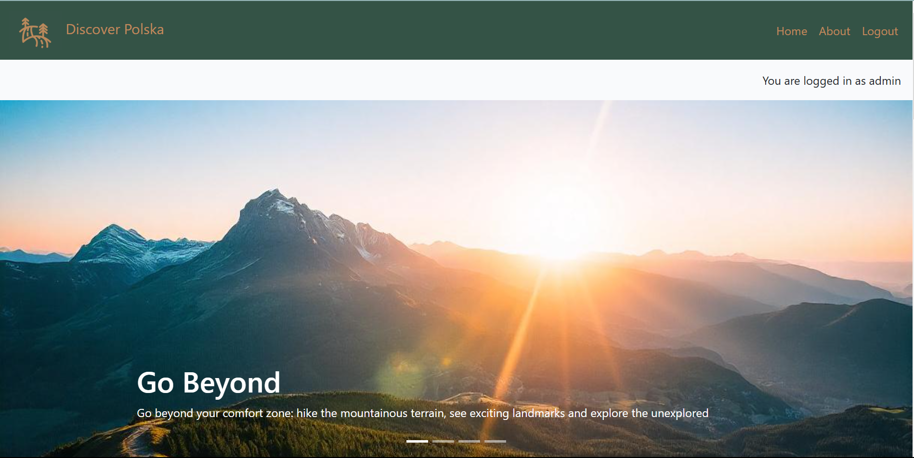

### Django alert messages
Everytime a change is made, there is an alert message; whether that is logging in/ out, when the user makes, edits or deletes a comment there is an automatic message ('Your comment is awaiting approaval' etc. )

 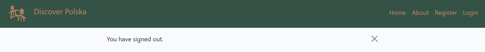

### Clear indication as to whether the user is logged in or out at all times
The base.html file is responsible for displaying a "You are logged in as username" or "You are not logged in" depending on the boolean state of authentication.
Below is a screenshot of when the user is logged in. 

 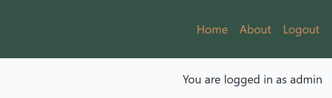

### A list of blog posts
For ease of access, the user has a clear visual of all the blog posts; Individual blog posts are displayed under one another on mobile screens or 6 on each page on a laptop/desktop. Each blog post has an individual image to draw attention, the author and an excerpt of the blog post for user to get a quick gauge of whether it is of interest to them. 

 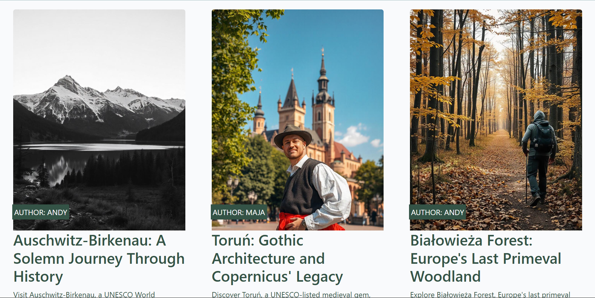

### See an individual blog post in detail
When a blog title or excerpt is clicked the post detail.html is rendered displaying a default image that is on all pages (same in every blog post), but also a mast head underneath the hero image with the blog title, author and date of publishing. Underneath this is the entire blog text/content as well as a comment count, comments section and a form to add your own comment if you are a logged in user.

 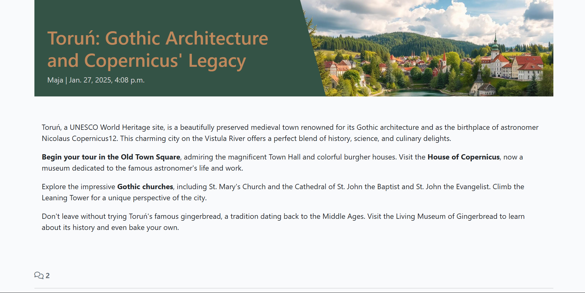

### Pagination
Pagination makes a long list of blog posts more manageable for users. It is comprised of 'next' and 'prev' buttons as well as a count of the pages available to view. This is to make users aware of how many pages they will need to click through ahead of time, rather than having them click endlessly. Six blogs are shown per page on this website.

 

### About page
The user does not need to be logged in to view the About Me page. It includes an image of a Polish location to link to the admin's polish heritage and refer to the point of the blog. The about content explains the origin of the author, the point of the blog (travel locations in Poland and advice) and encourages the user's independent exploration. 
Underneath this is a contact us form targeted at both travel agencies/ other bloggers and users to get in contact with thier own experiences or other locations they think are worth visiting in Poland. 

 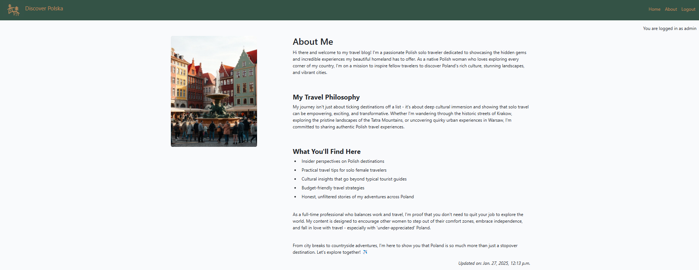

### Custom Model: Contact us form
This is located at the bottom of the about me page and any requests are also visible in the Django administration panel. This is my custom model of choice, the initial code basis was take from the CodeStar walthrough project, however for the purposes of this project, it was adapted to be a contact request form, with the users name, email, subject, message and destination (that they are referring to or are wanting to explore further). Only the name, message and email fields are mandatory due to communication purposes. 
 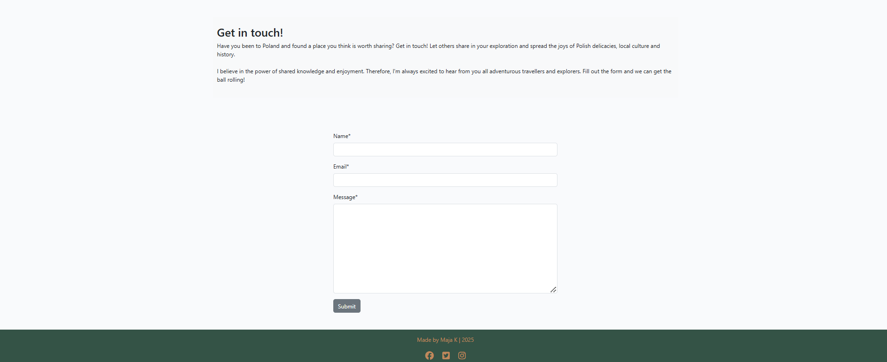

### Sign in form
This is a crispy form that asks for username and password and offers a 'remember me' option for ease of access in the future. 
   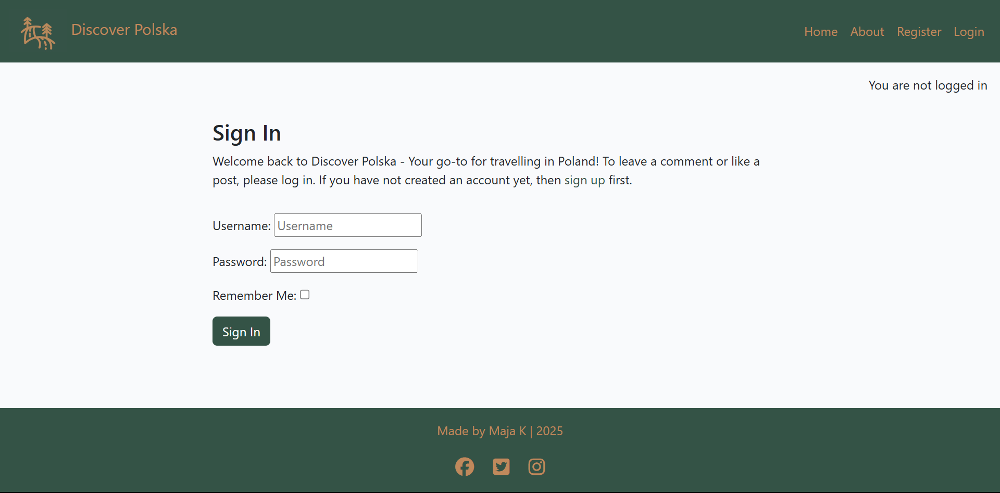

### Register form (Sign up)
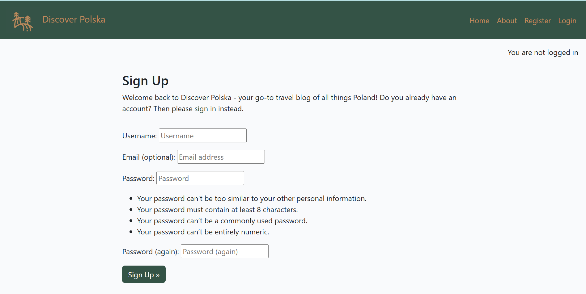

### Sign out page
The signout page confirms the user's actions to sign out of the blog: 'Are you sure you would like to sign out?'
   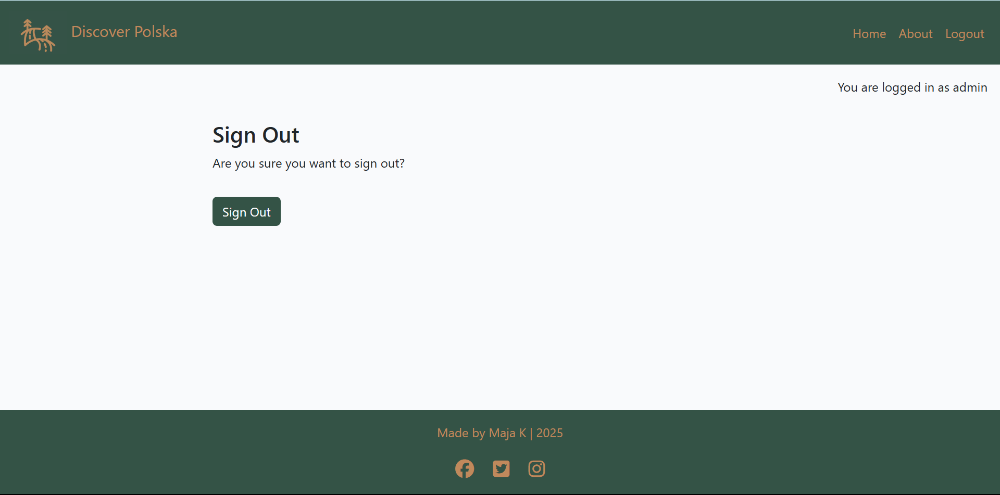

   ### Quote
   This quote section is located underneath the hero image and before the blog list. It is designed to act as a break between the two sections so that the overall page does not look cluttered to the user. 

 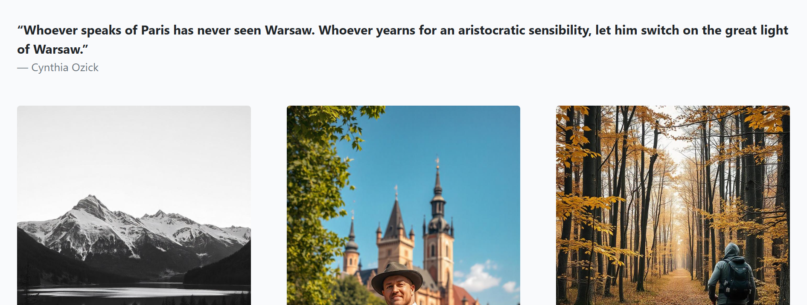